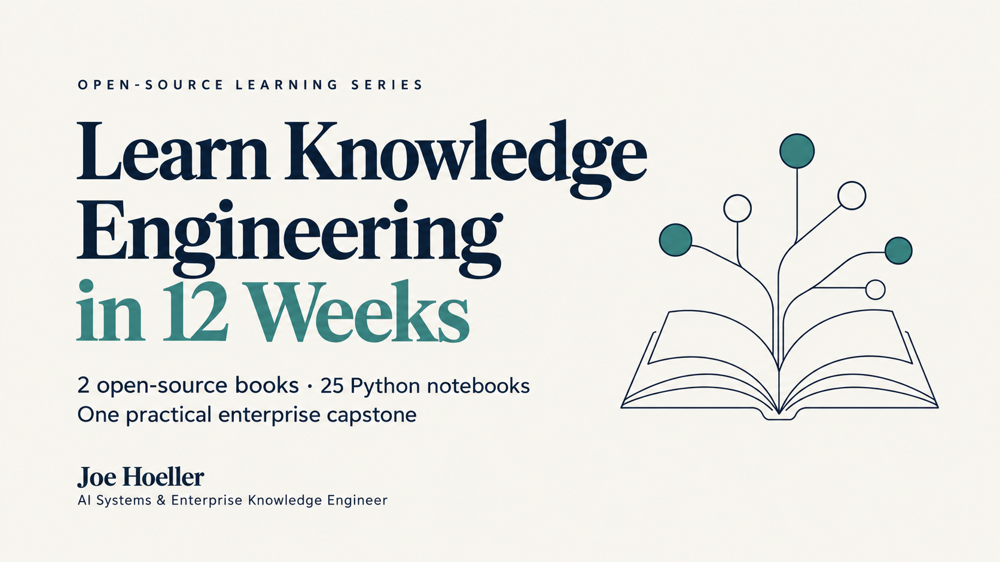

# Enterprise Ontology Engineering — healthcare edition


### Become a Knowledge Engineer in 12 weeks with capstone project
What you will learn: The course covers these skills, from the business question through a REAL working knowledge product:

1. **Business value and competency questions** — Define who needs an answer, what decision it supports, and how success will be measured.

2. **Source data and provenance** — Inspect real Kaggle data, preserve source meaning, document licenses, and reproduce the selected dataset.

3. **RDF fundamentals** — Represent information as subjects, predicates, and objects; distinguish IRIs, literals, graphs, and datasets.

4. **Identity modeling** — Give separate identities to people, events, records, and record versions without accidentally merging them.

5. **Controlled vocabularies** — Establish consistent terminology, preferred labels, alternative labels, definitions, and scope notes.

6. **Taxonomy construction** — Organize concepts into broader and narrower categories; detect hierarchy cycles and inconsistent labels.

7. **SKOS and thesauri** — Represent vocabulary schemes, synonyms, hierarchical relationships, and related concepts in a standard format.

8. **Taxonomy alignment with SKOS** — Choose appropriate mapping relationships, check their direction, document evidence, and separate proposed mappings from approved ones.

9. **Clinical code alignment** — Preserve historical ICD-9-CM values while reviewing separate ICD-10-CM and ICD-11 terminology layers.

10. **TBox, ABox, and RBox** — Distinguish class definitions, individual facts, and relationship axioms within an ontology.

11. **OWL modeling** — Define classes, properties, restrictions, disjointness, equivalence, and relationships that support useful conclusions.

12. **Necessary and sufficient conditions** — Understand when an axiom constrains class membership and when it enables a reasoner to infer membership.

13. **BFO foundations** — Distinguish objects, processes, roles, qualities, and information entities when choosing foundational categories.

14. **Ontology alignment** — Connect domain classes to foundational categories using defensible subclass or equivalence relationships.

15. **Top-down and bottom-up engineering** — Start with foundational categories or domain requirements, then reconcile them through a shared model.

16. **Upper and lower bounds** — Separate architectural layers from logical bounds, including what is definitely included, potentially included, or unresolved.

17. **OWL reasoning profiles** — Compare RL, DL, EL, and QL and understand how modeling requirements affect reasoner selection.

18. **OWL DL reasoning** — Check profiles and consistency, classify named individuals, and inspect consequences using OWLAPI and HermiT.

19. **Reasoning caveats** — Handle open-world assumptions, identity, unnamed existential witnesses, cardinality, property chains, and unsatisfiable classes.

20. **SHACL validation** — Check explicit data requirements, inspect validation failures, and distinguish missing data from logical inconsistency.

21. **SWRL rules** — Write and execute a basic relationship rule; understand support limits and when another mechanism fits better.

22. **SPARQL fundamentals** — Use SELECT, ASK, CONSTRUCT, and the other query forms to inspect and retrieve graph information.

23. **SPARQL expressions and parameters** — Work with datatypes, language tags, FILTER, BIND, VALUES, COALESCE, and parameter binding.

24. **Missing values and negation** — Understand OPTIONAL, unbound variables, MINUS, and NOT EXISTS without confusing absence with logical falsehood.

25. **Joins and aggregation** — Count at the correct level of detail and recognize duplicate results caused by joins.

26. **Property paths** — Traverse taxonomy relationships while distinguishing graph reachability from ontology reasoning.

27. **Named graphs and updates** — Control query scope, separate asserted and derived information, and practice reversible graph updates.

28. **Querying OWL DL results** — Query selected reasoner outputs while declaring exactly which entailments the exported graph contains.

29. **Blank nodes and OWL structures** — Inspect anonymous restrictions and RDF lists without treating temporary identifiers as durable business keys.

30. **Relational-to-ontology mapping** — Translate warehouse records into RDF, understand R2RML mapping specifications, and reconcile SQL with SPARQL.

31. **Evidence and explanations** — Trace an answer to source identifiers, transformation policies, ontology axioms, and model versions.

32. **Ontology extension** — Add definitions and axioms while checking profile compliance, consistency, and the impact on existing answers.

33. **Versioning, regression, and retraction** — Compare answer identities across releases, rebuild unsupported conclusions, and plan coherent rollback.

34. **Query debugging and portability** — Diagnose syntax, dataset, datatype, join, and entailment problems; understand endpoint and federation boundaries.

35. **Semantic data products and catalogs** — Use DCAT and provenance metadata to make datasets discoverable, understandable, and reusable.

36. **Governance and operation** — Define ownership, approval responsibilities, access policies, freshness, support, service expectations, and operating costs.

37. **AI integration** — Design an assistant around approved queries, controlled access, evidence checks, and clearly stated reasoning limits.

38. **Python notebook workflows** — Run reproducible exercises using RDFLib, pySHACL, owlrl, Owlready2, and the supporting Java reasoning tools.

39. **Communication and peer review** — Explain the same inference to an engineer and a business stakeholder; evaluate models using a review rubric.

40. **Capstone and adoption measurement** — Deliver an inference, evidence, cataloged product, and pilot scorecard measuring correctness, usability, adoption, and cost.
    
© 2026 Joe Hoeller, AI Systems & Enterprise Knowledge Engineer

Start with the Primer PDF, then open E00 in notebooks/enterprise. The Workbook PDF follows the executable labs. This edition includes **25 learner notebooks and 25 separate solutions**: 15 enterprise lessons and 10 SPARQL lessons.

You will build a review workbench from 60 published Kaggle encounter records, align a small taxonomy with SKOS, import BFO, classify with OWL DL, validate with SHACL, try a bounded SWRL rule, reconcile SQL and SPARQL, and package a semantic data product. Learners will measure whether people can use the product, alongside checking whether its answers are correct.


## Setup — macOS / Linux

Install Python 3.12 and a Java 17 JDK, then run from this extracted folder:

```bash
python3.12 -m venv .venv
source .venv/bin/activate
python -m pip install -r requirements.txt
python -m ipykernel install --user --name ontology-lab --display-name "Ontology Lab (Python 3)"
java -version
jupyter lab
```

## Setup — Windows PowerShell

```powershell
py -3.12 -m venv .venv
.venv\Scripts\python.exe -m pip install -r requirements.txt
.venv\Scripts\python.exe -m ipykernel install --user --name ontology-lab --display-name "Ontology Lab (Python 3)"
java -version
.venv\Scripts\jupyter.exe lab
```

Choose **Ontology Lab (Python 3)** as the notebook kernel. The core labs need no external service. Initial package installation requires internet access; source data, BFO and code references are included. If Java is not found, configure the installed JDK before launching JupyterLab. The JVM loaded by JPype cannot be restarted with a different classpath inside one kernel: restart the kernel after changing Java or reasoner versions.

## Study and verification

Each notebook has a walkthrough, an editable `answer = None` exercise, a check and a teach-back prompt. An unanswered exercise prints an incomplete message. It does not count as passed. Use the solutions after your attempt. E14 adds SWRL and can be completed before the E13 capstone.

```bash
python tools/verify_semantics.py
python tools/execute_notebooks.py
```

The normal runner uses Jupyter kernels. If the environment does not permit kernel socket transports, use the separate cell runner:

```bash
python tools/execute_cells.py
python tools/execute_cells.py --learners
```

The delivered solutions were executed in fresh IPython processes, sequentially cell by cell. TCP and IPC kernel transports are unavailable in the build environment. The reports identify the exact verification backend. Notebook cell behavior and semantic checks are verified; a Jupyter browser session, external endpoint and human pilot are not claimed as tested.

## Source and terminology boundaries

The source is Kaggle `brandao/diabetes`, version 1. The dataset's historical diagnoses use ICD-9-CM. The included ICD-10-CM and ICD-11 tables are later reference vocabularies, not reassigned source diagnoses. The requested ICD-20 label is corrected to ICD-11 for this edition. Only three source diagnosis groups are selected, with 20 rows each. This is a purposeful learning subset and is not a population estimate.

`data/source_manifest.json` contains selection details and checksums. `tools/rebuild_subset.py --download` downloads the source and reproduces the subset; `--archive PATH` uses an existing download. A changed source checksum stops the rebuild. Code-family classifications are explicit local transformations. Cross-version mapping proposals are not promoted to accepted clinical crosswalks.

## Files

| Folder | Purpose |
|---|---|
| notebooks | Editable learner notebooks |
| solutions | Completed notebooks with execution outputs |
| ontology | Full pinned BFO core, domain axioms, SKOS, SHACL and R2RML specification |
| ontology_lab | Executable Python adapter, DL bridge and optional HTTP helper |
| data | Small source subset, terminology references and provenance |
| queries | Runnable SPARQL query bank |
| docs | Gap audit, topic crosswalk, product contract and pilot plan |
| reports | Cell-execution and semantic-check evidence |
| book | Editable book Markdown and curriculum source |
| licenses | Required third-party notices |

The `requirements-lock.txt` records the verified Python environment; `requirements.txt` pins direct dependencies. `requirements-book.txt` is only needed to rebuild the PDFs.

## Rebuild the books

Edit the two files in `book/*.md`, install `requirements-book.txt`, and run `python tools/build_pdfs.py`. Install the DejaVu Serif, Sans and Sans Mono fonts first. On systems with fonts elsewhere, set `FONT_DIR` to their directory. The books use linked contents, bookmarks, chapter headings, page numbers and the chapter-specific copyright footer.

## Deployment boundary

The HermiT exporter returns named class memberships, not a complete SPARQL OWL Direct Semantics endpoint. The isolated SWRL exercise has its own supported positive rule and does not broaden the core OWL DL profile claim. The optional HTTP client is provided for a separately provisioned SPARQL endpoint. There is no automatically created cloud service, credential, production dataset or human pilot.

## License

Book text and notebooks: CC BY 4.0. Original Python utilities: MIT. Published source data, BFO, code-system content and adapted course material retain their original rights and attribution, described in `licenses/NOTICE.md`. These grants do not claim ownership of third-party clinical classifications or imply endorsement.
